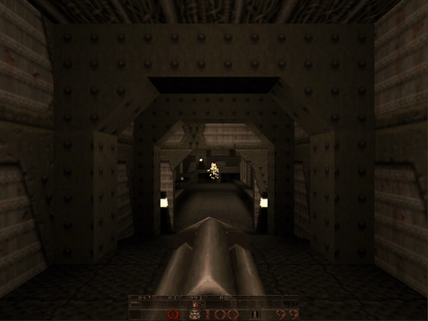
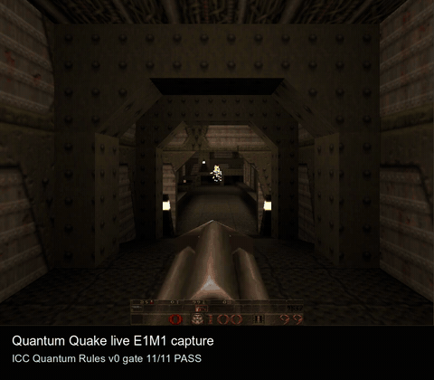
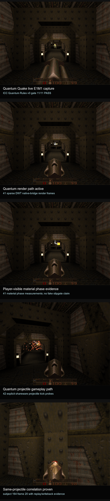
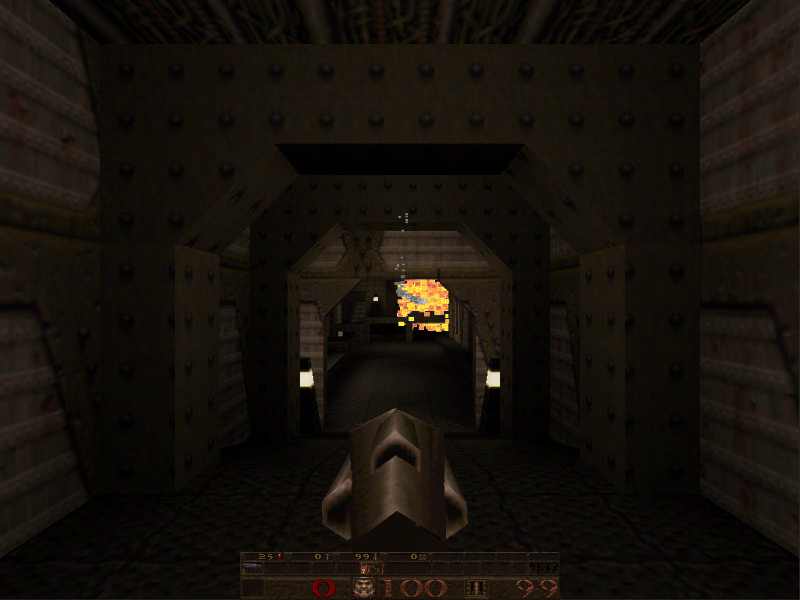

# Quantum Quake

**Real Quake. Real id1 maps. Rendered, simulated, and reasoned about through a quantum game engine.**

Quantum Quake is the first conformance title for **QGE** — the Moonlab-backed
**Quantum Game Engine** — a runtime layer that progressively moves a classic
game's authoritative domains (rendering, visibility, physics, audio, AI, RNG)
off the conventional CPU path and onto bounded, *traceable*, simulated-quantum
computation. The host is [QuakeSpasm](https://github.com/sezero/quakespasm); the
content is your own licensed Quake; the engine underneath is new.

<p align="center">
  <br>
  <em>Live E1M1 capture. Every frame above is produced by the QGE quantum render path
  (<code>quantum_render 2</code>), not classic GL — sparse discrete-wavelet reconstruction
  with per-surface ownership telemetry on each frame.</em>
</p>

> **What this is, in one breath:** you load `e1m1`, you walk the slipgate base,
> you fire the shotgun — and the pixels, the visible-set, the projectile
> trajectories, and the entropy behind them are computed by a quantum runtime and
> emitted as auditable evidence. Nothing here is mocked: every claim on this page
> is backed by a trace, a metric, a screenshot, or an ICC task attempt.

---

## Table of Contents

- [Why this exists](#why-this-exists)
- [What's actually *quantum* about it](#whats-actually-quantum-about-it)
- [The QGE architecture](#the-qge-architecture)
- [Honesty by construction: the claims ledger](#honesty-by-construction-the-claims-ledger)
- [Current status — what works today](#current-status--what-works-today)
- [Quick start](#quick-start)
- [Renderer evidence](#renderer-evidence)
- [For researchers: quantum advantage & the oracle compiler](#for-researchers-quantum-advantage--the-oracle-compiler)
- [Repository layout](#repository-layout)
- [Documentation map](#documentation-map)
- [License & credits](#license--credits)

---

## Why this exists

Most "quantum games" are either (a) a quantum-themed skin over classical code, or
(b) a toy circuit that has nothing to do with a real, playable game. Quantum Quake
is an attempt at the hard, honest version of the idea:

> *Take a complete, beloved, fully-specified classical game — Quake — and rebuild
> its authoritative runtime domains, one at a time, on a quantum computational
> substrate, while keeping the original as a frame-by-frame reference oracle so
> every divergence is measurable.*

Quake is the perfect subject. Its rules are exhaustively documented, its renderer
and physics are deterministic, and a reference build exists to diff against. That
means QGE can make a falsifiable claim — "this domain now runs under quantum
authority" — and *prove* it against vanilla Quake instead of asking you to take
its word for it.

The engine is the product. **Quantum Quake is the first conformance title, not the
boundary of the engine** — QGE is designed to host any game that wants
quantum-owned runtime domains, bounded quantum observables, and research-grade
benchmark artifacts.

---

## What's actually *quantum* about it

This is the question every serious reader asks first, so here is the direct
answer, with receipts. The clip below is the **annotated "quantum distinctions"
capture** — the same E1M1 playthrough, with each player-visible quantum behavior
called out as it happens:

<p align="center">
  
</p>

<table>
<tr><th>Distinction</th><th>What you're seeing</th><th>Evidence in this capture</th></tr>
<tr>
  <td><b>Quantum render path</b></td>
  <td>The framebuffer is reconstructed from a <b>sparse discrete-wavelet transform</b> evaluated on the Moonlab quantum runtime, then bridged to native pixels — not drawn by the classic GL rasterizer.</td>
  <td>41 sparse-DWT native-bridge render frames</td>
</tr>
<tr>
  <td><b>Material phase observables</b></td>
  <td>Surface material transitions are scored as bounded quantum <i>phase</i> measurements that are visible in the frame — no faked "slipgate shimmer," only measured phase.</td>
  <td>41 player-visible material-phase measurements</td>
</tr>
<tr>
  <td><b>Quantum projectile path</b></td>
  <td>Projectile kicks (your shots, enemy fire) flow through a quantum physics path that produces a measured trajectory field, with replay and writeback evidence.</td>
  <td>42 explicit shareware projectile-kick probes</td>
</tr>
<tr>
  <td><b>Same-projectile correlation</b></td>
  <td>A single projectile is followed across frames and proven to be the <i>same</i> measured subject via replay/writeback correlation — quantum state with identity, not per-frame noise.</td>
  <td>subject 164, frame 20, replay + writeback evidence</td>
</tr>
<tr>
  <td><b>Conformance gate</b></td>
  <td>The whole capture passes the <b>ICC Quantum Rules v0 gate</b>, an external, adversarial check that every quantum-rule claim in the run is backed by evidence.</td>
  <td>ICC Quantum Rules v0 gate: <b>11/11 PASS</b></td>
</tr>
</table>

<p align="center">
  <br>
  <em>The five annotated quantum-distinction moments as a contact sheet.</em>
</p>

What is **not** claimed: no practical quantum-hardware speedup, no dense
70,000-qubit state, no whole-game hardware execution. Those are research targets
with their own fail-closed gates (see [below](#for-researchers-quantum-advantage--the-oracle-compiler)).
The distinctions above are *simulated-quantum* runtime behavior that is real,
reproducible, and player-visible today.

---

## The QGE architecture

QGE is ~11k lines of portable C (`qge/`) plus integration hooks inside the
QuakeSpasm host (`quake/Quake/qge_*.c`). It is built around one idea: **a game
frame is a research problem**, and every runtime domain can be progressively
handed from the CPU to a quantum runtime under measurement.

### The runtime pipeline

A frame flows through six layers:

| Layer | Role |
|---|---|
| **1. World registry** | Stable resources: BSP models, surfaces, textures, lightmaps, alias/sprite models, HUD images, sounds. |
| **2. Frame snapshot** | Immutable per-frame state: camera, visible surfaces, entities, particles, sounds, lights, entropy refs, ownership counters. |
| **3. Scene / media graph** | The renderable + audible graph the quantum domains actually consume. |
| **4. Quantum runtime** | Moonlab-backed states, gates, measurements, entropy, probes, entanglement edges — and explicit, traced fallbacks. |
| **5. Observable compiler** | Turns scene/media state into *bounded observables* and oracle IR (the research-mode boundary). |
| **6. Artifact layer** | Trace, replay, claims evidence, benchmark metrics, circuits, resource estimates. |

### Eight domains, three ownership stages

Every game domain climbs the **same ladder** — and crucially, *every fallback to
the classical path is recorded as a trace event. Silent fallback is a publication
blocker.* This is what makes the claims falsifiable.

```
   SHADOW            →     ADVISORY / COMPOSITE      →        AUTHORITATIVE
   QGE observes &          QGE output is visible or          QGE owns the final
   reports what it         affects bounded choices           frame / audio block /
   would do                                                  visible-set / projectile
```

The eight domains currently modeled:

- **render** — sparse DWT, dense reference, material/phase observables
- **visibility** — surface/entity visible-set probabilities and search predicates
- **media / audio** — per-source and post-mix quantum transducers
- **physics / projectiles** — shadow and authoritative measured trajectory fields
- **particles** — field-based particle ownership
- **AI** — legal-action probability registers and measured choices
- **RNG / entropy** — replayable, domain-tagged quantum entropy
- **UI** — HUD, console, menu, glyph, and 2D-media ownership

### Two modes at once

- **Conformance mode** — reproduce vanilla Quake faithfully enough that QGE is a
  credible runtime. Completion is defined precisely: *Quantum Quake is "done" only
  when `quantum_render 2` can play vanilla Quake with the classic 3D and 2D draw
  paths hidden.*
- **Research mode** — compile game state into quantum oracle/observable problems
  with explicit input model, readout, classical baseline, and resource cost.

Deeper reading: **[docs/qge_engine_architecture.md](docs/qge_engine_architecture.md)**
and the full **[architecture plan](docs/quantum_quake_full_architecture_plan.md)**.

---

## Honesty by construction: the claims ledger

The thing that should make a skeptical reader *trust* this project is that it is
engineered to make overclaiming hard. Quantum Quake treats prose as
**unsupported by default**. A statement only becomes a "claim" when it maps to a
machine-readable evidence contract in
**[docs/claims/qge_claims.json](docs/claims/qge_claims.json)**, with:

- a typed `claim_type` (feasibility, conformance, benchmark, query_advantage, sample_complexity, systems),
- explicit `allowed_wording` **and** `disallowed_wording`,
- a formal `problem_statement`, `input_model`, and `output_observable`,
- the `classical_baseline` it must beat,
- the exact `required_trace_fields` and `accepted_evidence` artifacts,
- and the `failure_conditions` that would invalidate it.

On top of that, the repository is continuously audited by **ICC** (Infinite
Context Coder), an external control plane that runs completion oracles, source-drift
checks, runtime-evidence gates, and adversarial production audits. The shareware
release you're looking at is gated on those oracles reading green — and the
honest blockers (e.g. *"the full registered game does not run under Moonlab yet"*)
are reported as **fail-closed gates**, not quietly omitted.

> If a claim cannot be validated from traces, sidecars, metrics, circuits, and
> baseline artifacts, it is not supported. — `docs/qge_claims_ledger.md`

See **[docs/qge_publication_adversarial_audit.md](docs/qge_publication_adversarial_audit.md)**
for the adversarial-review posture.

---

## Current status — what works today

This is an **active research and systems-engineering project**, not a finished,
player-facing Quake distribution. Here is the honest split.

### ✅ Working and routinely verified

- Moonlab-backed QGE core runtime: trace, RNG, AI, render, visibility, audio,
  physics, and world-snapshot libraries.
- A macOS QuakeSpasm app build with QGE hooks and cvars.
- **Sparse-DWT QGE primary rendering** with world-surface, material, lightmap,
  entity, and HUD/console ownership telemetry, native IDWT evidence, and explicit
  fallback reasons. The render refreshes the QGE primary output **every host
  frame** by default and derives display gain from deterministic state marginals
  (no finite-shot shimmer).
- QGE **visibility** shadow/parity paths with audited authority-gate telemetry.
- QGE **projectile** shadow/writeback/collision-oracle evidence with replay and
  persistence-boundary trace records.
- QGE **audio** post-mix and source-mode telemetry, including source-authority
  smoke checks.
- **Noesis** autonomous-agent play on `e1m1` (no-script server control by
  default, with engine-side assist telemetry, route/combat summaries, and local
  wall/floor/hazard probes).
- Reproducible diagnostic streams under `diagnostics/`.

### 🚧 In progress / explicitly **not** claimed

- `quantum_render 2` **is not visually complete.** It is a diagnostic primary path
  with strong ownership telemetry, not a finished replacement for classic Quake
  rendering. Remaining issues are projection/material problems: residual tone
  mismatch, raster seams, warp/water seams, and viewmodel material parity.
- QGE is **not yet the sole owner** of all vanilla Quake media (sky, water/warp,
  full conformance lighting, particles, sprites, menus, edge cases are in progress).
- Noesis is **not** learning Quake from experience and has no map-level world model
  yet; default runs are reactive autonomous diagnostics.
- **Practical quantum-hardware advantage is not a current claim.** Supported
  claims are limited to bounded simulated-QPU observables, scene-oracle IR, and
  explicitly scoped query/sample-complexity experiments.
- Whole-game Moonlab deployment is **fail-closed blocked**: the shareware episode
  covers **9/32** canonical single-player maps; the remaining 23 require licensed
  registered BSP assets you supply yourself (the project ships no game data).

The current public snapshot is the
**`quantum-quake-shareware-20260624-shareware-v8`** bundle: shareware episode 1,
9/9 shareware maps captured, 945 native sparse-DWT bridges, Noesis smoke grade
`strong_smoke` (84.0), with the registered full-game gate honestly `blocked`.

---

## Quick start

> **You need your own licensed Quake data.** Quantum Quake ships **no** game
> content — no `pak0.pak`/`pak1.pak`, no maps. Place your licensed `id1` data
> under `assets/id1/`. The shareware `pak0.pak` works for episode 1.

### Build & run the engine

```sh
# Core QGE test binary (fastest way to confirm the build works)
make test_qge
./bin/test_qge

# Full contract suite (C + shell + Python)
make test

# Build the macOS QuakeSpasm app bundle with QGE hooks
make quake
```

### See the quantum renderer (fixed-view diagnostic)

```sh
QGE_STREAM_LAUNCH=open QGE_STREAM_MOUSE=0 QGE_STREAM_ACTIVATE=0 \
QGE_STREAM_TRACE=1 QGE_STREAM_MAP=e1m1 QGE_STREAM_FRAMES=1 \
QGE_STREAM_WAIT_FRAMES=12 QGE_STREAM_PLAYER=none QGE_RENDER=2 \
QGE_RENDER_UPDATE_INTERVAL=1 QGE_STREAM_SOUND=0 \
bash tools/quake_graphics_stream.sh
```

### Watch the autonomous Noesis agent play

```sh
QGE_STREAM_LAUNCH=open QGE_STREAM_MOUSE=0 QGE_STREAM_ACTIVATE=0 \
QGE_STREAM_TRACE=1 QGE_STREAM_MAP=e1m1 QGE_STREAM_FRAMES=3 \
QGE_STREAM_WAIT_FRAMES=12 QGE_STREAM_PLAYER=noesis QGE_RENDER=2 \
QGE_RENDER_UPDATE_INTERVAL=1 QGE_STREAM_SOUND=0 \
bash tools/quake_graphics_stream.sh
```

On macOS, `QGE_STREAM_LAUNCH=open` is the validated safe path for app-bundle GL
context startup. Agent/CI runs set `QGE_STREAM_MOUSE=0` and
`QGE_STREAM_ACTIVATE=0` so the harness never steals input unless a human is
intentionally testing interactivity. `QGE_RENDER_UPDATE_INTERVAL=1` is the
default; it is shown above to make fixed-view evidence explicit.

---

## Renderer evidence

The renderer is the most visible — and most honestly tracked — part of the
project. The current baseline is **improved but still visibly glitchy**, and it is
developed as a *sequence of narrow, individually-verified fixes* rather than one
sweeping "it's done" claim. A representative still:

<p align="center">
  
</p>

Each renderer slice is captured as a fixed-view frame set and scored against the
classic reference with a dependency-free PNG metric tool
(`tools/qge_world_frame_metrics.py`, standard-library only — no numpy/Pillow
required). On every captured frame the run asserts QGE ownership of world
geometry, textures, lightmaps, HUD/console, and the viewmodel
(`own_world=1 own_textures=1 own_lightmaps=1 own_viewmodel=1 own_console=1`,
`fallback_reason=none`).

Whole-frame RMSE against the classic reference has been driven down one verified
slice at a time — for example to `0.0349406` after the alias-skin viewmodel pass
and `0.0343281` after the moderate-minification texture prefilter — alongside
targeted material work such as the world fullbright sampling scale split and a
diagnostic notify cleanup that keeps QGE render/snapshot milestones in the logs
instead of painting them over the world. As one example of the disciplined,
measured progression, the cumulative viewmodel work drove the first-person weapon
crop RMSE from `0.161956` down to `0.019361` across **nine** verified passes,
while keeping the named world crops stable (zero candidate drift). The latest
fixed-view evidence lives at `diagnostics/quake_graphics/20260522-164822/metrics.md`.

The strongest self-contained ICC evidence pack reports the strict vanilla/QGE
runtime ownership matrix with `qge_vanilla_runtime_complete` ready — i.e. on the
captured frames QGE, not classic GL, owns world geometry, textures, lightmaps,
HUD/console, and the viewmodel with `fallback_reason=none`.

**What is still broken** is documented just as carefully: light-emissive regions
are still too dim, nearby floors are slightly over-lifted, raster seams remain
visible, turbulent water/warp materials are not vanilla-quality, and the viewmodel
still needs classic placement parity. Treat `quantum_render 2` as a *diagnostic
primary path with useful ownership telemetry*, not a finished renderer.

Full slice-by-slice history with every RMSE delta:
**[docs/qge_state_of_development.md](docs/qge_state_of_development.md)**.

---

## For researchers: quantum advantage & the oracle compiler

QGE's research mode compiles a game frame into a bounded quantum problem with an
explicit input model, readout, classical baseline, and resource cost. The pieces:

- **Scene / oracle IR** — a compiler boundary from captured Quake state to
  auditable oracle inputs. See **[docs/qge_scene_oracle_ir.md](docs/qge_scene_oracle_ir.md)**.
- **Bounded observables** — render-gate finite-shot observables, soft-shadow
  visibility, patch irradiance, visibility confidence, DWT band energy, and
  material-phase scores.
- **Algorithm models** — finite-shot dense registers for small decisions,
  **amplitude estimation** for bounded light-transport means, **Grover /
  minimum-finding** for unstructured candidate search, and QSP/QSVT only once a
  real block encoding exists.
- **The hardware-advantage campaign** — a *planning-stage* artifact set targeting
  defensible quantum advantage on `light_transport_qae_query_scaling`, with a
  real Moonlab control-plane submission chain: an executable 32-qubit, 7,415-gate
  `Q_f` predicate kernel, a power-zero QAE observation circuit, and a selected
  Grover schedule (powers 0, 1, 2, 4) that fits Moonlab's 4 MB control-plane body
  limit (largest circuit: `grover_power=4` at 610,599 bytes). **This proves the
  campaign exists and is executable as control-plane text — not that hardware
  advantage has been demonstrated.** A `qge_real_hardware_quantum_advantage`
  oracle remains deliberately incomplete until a *returned* hardware result and a
  strong baseline exist.

Research entry points:

- **[Publishable results research](docs/qge_publishable_results_research.md)** — external baselines (Quandoom et al.) and the concrete results package for a defensible paper/demo.
- **[Quantum-advantage research roadmap](docs/qge_quantum_advantage_research_roadmap.md)** — bounded workloads and baseline expectations.
- **[Quantum signal processing research](docs/qge_quantum_signal_processing_research.md)** — QSP/QSVT context for QGE media experiments.
- **[Hardware-advantage campaign](docs/qge_hardware_advantage_campaign.md)** — the bounded-QAE hardware handoff plan and no-overclaim posture.

---

## Repository layout

```
quantum_quake/
├── qge/                  Reusable QGE runtime libraries (~11k LOC C)
│   ├── qge_render.c        sparse-DWT render path + material/phase observables
│   ├── qge_vis.c           visibility probabilities & search predicates
│   ├── qge_physics.c       projectile trajectory fields
│   ├── qge_audio.c         per-source / post-mix quantum transducers
│   ├── qge_ai.c            legal-action registers & measured choices
│   ├── qge_rng.c           replayable domain-tagged entropy
│   ├── qge_quantum_runtime.c   Moonlab-backed state/gate/measurement spine
│   ├── qge_world.c         world registry & frame snapshots
│   └── qge_trace.c         fixed-width binary trace
├── quake/Quake/          QuakeSpasm host engine + QGE integration hooks
│   ├── qge_hooks.c         the seam between classic Quake and QGE
│   └── snd_quantum.c       quantum audio source path
├── deps/moonlab/         Moonlab quantum simulation/runtime dependency
├── tools/                84 diagnostics, stream, publication, Noesis & benchmark helpers
├── tests/                C, shell, and Python contract tests
├── docs/                 Architecture, claims, roadmap & state docs (+ media/)
├── diagnostics/          Generated run artifacts — evidence inputs, not source
├── assets/id1/           ← place your licensed Quake data here (gitignored)
└── .icc/                 ICC policy/oracles used for drift, audit & task evidence
```

---

## Documentation map

Start with the curated hub: **[docs/README.md](docs/README.md)**. The most useful
documents, in reading order:

| Document | What it covers |
|---|---|
| [QGE state of development](docs/qge_state_of_development.md) | **Authoritative snapshot** — implemented systems, known gaps, renderer slice history, verification commands. |
| [QGE engine architecture](docs/qge_engine_architecture.md) | The reusable engine model: layers, domains, ownership stages, artifact contract. |
| [Moonlab full Quake port](docs/moonlab_full_quake_port.md) | The whole-game authority contract and what "done" means. |
| [QGE agent media stream](docs/qge_agent_stream.md) | The live graphics/audio/Noesis diagnostic harness and manifest contract. |
| [QGE claims ledger](docs/qge_claims_ledger.md) | The rules for supported wording and evidence. |
| [Full architecture plan](docs/quantum_quake_full_architecture_plan.md) | The long-range target architecture and quantum-native capability matrix. |

---

## License & credits

Quantum Quake builds on **[QuakeSpasm](https://github.com/sezero/quakespasm)**, a
modern, faithful Quake engine, which is GPLv2 (as is the original
[id Software Quake engine source](https://github.com/id-Software/Quake)). The QGE
layer and Quantum Quake additions are distributed under the same terms; see
`quake/LICENSE.txt` and the QuakeSpasm license headers.

**Quantum Quake ships no id Software game content.** You must supply your own
licensed Quake data (the shareware `pak0.pak` is sufficient for episode 1).

- **Engine host:** QuakeSpasm (sezero et al.) on the id Software Quake engine.
- **Quantum runtime:** Moonlab quantum simulation/runtime.
- **Verification control plane:** ICC (Infinite Context Coder).

Copyright © 2026 tsotchke. Quantum Quake and QGE are research software:
claims are bounded, evidence-backed, and deliberately conservative.
</content>
