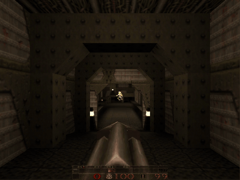

# Quantum Quake

Quantum Quake is a playable build of Quake, on the QuakeSpasm engine, whose rendering, visibility, physics, audio, AI and random-number domains are progressively handed to QGE, a quantum game-engine runtime layer written in C and backed by the Moonlab quantum simulator. It is the conformance title for QGE: classic Quake stays as the host, the compatibility shell and the frame-by-frame reference oracle, and every domain that QGE takes over is traced, measured against vanilla, and gated by ICC completion oracles so that nothing is claimed without evidence. In the Tsotchke ecosystem it is Moonlab's largest embedded application and the only product that exercises Moonlab's state, gate, measurement, Grover and QRNG v3 surfaces inside a real-time host, with Noesis as its optional autonomous player and ICC as its verification control plane.

<p align="center">
  <br>
  <em>E1M1 capture through the QGE quantum render path (<code>quantum_render 2</code>): sparse discrete-wavelet reconstruction with per-surface ownership telemetry on every frame.</em>
</p>

## What this is

A fork of QuakeSpasm (`quake/`, GPLv2) with two integration seams, `quake/Quake/qge_hooks.c` (`QGE_*` entry points) and `quake/Quake/snd_quantum.c`, that route the host's authoritative work into QGE (`qge/`, 12,095 lines over 17 files on this checkout), which in turn runs on Moonlab compiled from the `deps/moonlab` submodule. QGE models eight runtime domains (render, visibility, media/audio, physics/projectiles, particles, AI, RNG/entropy, UI), and each domain climbs the same three-stage ownership ladder, shadow, advisory/composite, authoritative, with every fallback to the classical path recorded as a trace event. The repository also carries the research side of the same engine: a scene/oracle intermediate representation that compiles captured game state into bounded quantum observables, a machine-readable claims ledger, and the publication, benchmark and Moonlab hardware-handoff tooling under `tools/`.

What it is not: a quantum-themed skin over classical code; a finished player-facing Quake distribution; a demonstration of quantum-hardware advantage. `quantum_render 2` is a diagnostic primary render path with ownership telemetry, not visually complete; practical hardware advantage is not a current claim, and the ledger forbids that wording. The project ships no id Software game content: you supply your own licensed `id1` data under `assets/id1/` (the shareware `pak0.pak` covers episode 1).

The enthusiast-facing narrative, the annotated "what is quantum about it" table and the research-mode description that formed the previous README are preserved verbatim, dated, in [docs/quantum_quake_showcase.md](docs/quantum_quake_showcase.md).

## Where it sits in the Tsotchke ecosystem

Quantum Quake consumes Moonlab and is consumed by nothing: no other first-party repository references it in code. The ecosystem map is in Selene (`ECOSYSTEM_MAP.md`, being written by tsotchke-chan; until then the canonical table is in Selene's `DOCUMENTATION_STANDARD_20261003.md`).

- **Moonlab** is a hard build dependency. `deps/moonlab` is a git submodule of tsotchke/moonlab pinned at `ac161232` (2026-05-22); the `Makefile` compiles Moonlab's quantum state, gates, measurement, entanglement, noise, tensor-network, Grover and QRNG v3 sources (`src/applications/qrng.c`, `entropy_pool.c`, `hardware_entropy.c`, `health_tests.c`, `bell_test.c`) into `libmoonlab` and links it under QGE. `qge/qge_quantum_runtime.c` calls `quantum_state_init`, `quantum_state_reset`, `quantum_state_free`, `grover_oracle`, `grover_diffusion`; `qge/qge_rng.c` calls `qrng_v3_init_with_config`, `qrng_v3_bytes`, `qrng_v3_verify_quantum`. The hardware-advantage campaign targets Moonlab's control plane for a bounded QAE submission ([docs/qge_hardware_advantage_campaign.md](docs/qge_hardware_advantage_campaign.md)). Moonlab's own Eshkol GPU backend file (`gpu_eshkol.cpp`) is compiled as part of Moonlab; QGE itself has no Eshkol dependency.
- **Noesis** is the optional autonomous player. `tools/noesis_quake_player.sh` and `tools/noesis_quake_policy.sh` drive a Noesis checkout (`QGE_NOESIS_DIR`, `QGE_NOESIS_CMD`) through the console harness, and the host exposes `QGE_NoesisAssistClientThink` and the `noesis_assist_*` telemetry fields. Noesis is not learning Quake from experience and has no map-level world model; default runs are reactive diagnostics ([docs/qge_agent_stream.md](docs/qge_agent_stream.md)).
- **ICC** is the verification control plane: the repo-local oracle profile `.icc/completion-oracles.json` (22 oracles) and the documentation-truth contract `.icc/doc-contract.json` are tracked and loaded by `make test`; shareware release, publication-pack and hardware-scope decisions are ICC oracle grades.
- **tsotchke-chan / Selene** holds the ecosystem map and the campaign ledger; she does not maintain this repository and nothing she serves depends on it.
- No code or document here references QGTL, tensorcore, qLLM, GeoRefine, MoThRA, quantum-blockchain or the mesh.

## Status and evidence

State: **research and systems-engineering project; shareware-episode public snapshot, not a release.** `master` is `c66083f` (2026-06-26), equal to `origin/master`, `origin/main` and every `tsotchke/task-*` branch; `origin/webgpu-moonlab` (2026-03-06) is an ancestor with no unmerged commits. Status date 2026-10-03; the repository has not changed since 2026-06-26.

| Capability | Status |
|---|---|
| Moonlab-backed QGE core: trace, RNG, AI, render, visibility, audio, physics, world snapshot (`make test_qge`) | **Working, test-backed** |
| macOS QuakeSpasm app bundle with QGE hooks and cvars (`make quake`) | **Working** |
| Sparse-DWT primary rendering (`quantum_render 2`) with world/material/lightmap/entity/HUD ownership telemetry and explicit `fallback_reason` | **Working; not visually complete** |
| Visibility shadow/parity paths with audited authority-gate telemetry | **Working** |
| Projectile shadow/writeback/collision-oracle evidence with replay and persistence-boundary traces | **Working** |
| Audio post-mix and source-mode telemetry with source-authority smoke checks | **Working** |
| Noesis autonomous play on `e1m1` (no-script server control, assist telemetry, route/combat summaries) | **Working as diagnostics** |
| QGE as sole owner of all vanilla media (sky, water/warp, conformance lighting, particles, sprites, menus) | **In progress** |
| Vanilla-quality renderer parity (tone, raster seams, warp seams, viewmodel placement) | **In progress** |
| Whole-game Moonlab deployment: 9 of 32 canonical single-player maps covered (shareware episode); the other 23 need licensed registered assets | **Fail-closed blocked** |
| Moonlab hardware submission chain (32-qubit, 7,415-gate `Q_f` kernel; Grover powers 0, 1, 2, 4; largest circuit 610,599 bytes under the 4 MB control-plane body limit) | **Executable as control-plane text; no returned hardware result** |
| Practical quantum-hardware advantage (`qge_real_hardware_quantum_advantage` oracle) | **Not a current claim; oracle deliberately incomplete** |

Headline evidence, each with where its receipt lives:

- Renderer RMSE against the classic fixed-view reference, scored by `tools/qge_world_frame_metrics.py`: whole-frame `0.0349406` after the alias-skin viewmodel pass and `0.0343281` after the moderate-minification texture prefilter; first-person weapon crop from `0.161956` to `0.019361` across nine verified passes with zero candidate drift; alongside the world fullbright sampling scale split and the diagnostic notify cleanup. Measured 2026-05-21/22; slice history with every delta in [docs/qge_state_of_development.md](docs/qge_state_of_development.md); the raw run `diagnostics/quake_graphics/20260522-164822/metrics.md` is gitignored and must be regenerated with `tools/quake_graphics_harness.sh`. The values are asserted by `tests/test_noesis_input_contract.sh` and `.icc/doc-contract.json`.
- Runtime ownership matrix: on captured frames QGE, not classic GL, owns world geometry, textures, lightmaps, HUD/console and the viewmodel (`own_world=1 own_textures=1 own_lightmaps=1 own_viewmodel=1 own_console=1`, `fallback_reason=none`), graded `qge_vanilla_runtime_complete` ready by the `qge_vanilla_quake_conformance` oracle. Receipt: the ICC task attempt for that oracle (local ICC artifacts, not tracked here).
- Public snapshot `quantum-quake-shareware-20260624-shareware-v8`: 9/9 shareware maps captured, 945 native sparse-DWT bridges, Noesis smoke grade `strong_smoke` (84.0, graded by `tools/qge_noesis_summary.py`), registered full-game gate `blocked`. Receipt: `diagnostics/publication_pack/20260624-shareware-v8` (gitignored; regenerated by `tools/qge_publication_pack.py`), cross-checked by `tests/test_qge_python_tools.py`.
- Moonlab QAE submission chain numbers (7,415 gates, 610,599 bytes) are asserted in `tests/test_qge_python_tools.py` and documented in [docs/moonlab_full_quake_port.md](docs/moonlab_full_quake_port.md).
- ICC on 2026-10-03 before this restructuring: 14 of 15 tracked documents reachable from the README; README claims 43, grounded 12, unsupported 19, unresolved 12; 104 of 3,694 public header symbols documented (the count is dominated by vendored QuakeSpasm headers). After numbers are in Selene's campaign ledger.

Every public claim must map to an evidence contract in [docs/claims/qge_claims.json](docs/claims/qge_claims.json) under the rules of [docs/qge_claims_ledger.md](docs/qge_claims_ledger.md); prose is unsupported by default.

## Build, run, test

Platform: macOS on Apple Silicon is the validated path (Metal, Accelerate, SDL2 app bundle); the `Makefile` also carries a Linux branch (AVX2, pthreads) for the QGE library and tests that is not routinely verified. Requirements: `clang`, `make`, `python3` (standard library only), the `deps/moonlab` submodule, and your own licensed Quake data under `assets/id1/` for anything that loads a map.

```sh
git clone --recurse-submodules https://github.com/Tsotchke-Corporation/quantum-quake.git
cd quantum-quake
make test_qge && ./bin/test_qge   # QGE core library and its C test binary
make test                          # the gate: C, shell and Python contract tests (11 test files under tests/)
make quake                         # QuakeSpasm + QGE + Moonlab macOS app bundle (QuantumQuake.app, bin/quantum_quake)
make run-quake                     # launch with -basedir assets
make demo && ./bin/quantum_demo    # headless QGE demo that writes quantum_frame_XX.ppm
```

`make test` runs `test_qge`, `test_console_contract`, `test_noesis_input_contract`, `test_qge_perf_summary`, `test_qge_trace_summary`, `test_qge_vanilla_matrix_perf`, `test_qge_publication_tools`, `test_qge_python_tools`, `test_qge_hardware_return_handoff`, `test_snd_quantum_source_contract` and `test_qge_audio_authority_smoke`; `test_noesis_input_contract` also enforces `.icc/doc-contract.json` against this README. Build products (`build/`, `bin/`, `*.app`, `Frameworks/`) and every run artifact under `diagnostics/` are gitignored.

Fixed-view renderer diagnostic and the Noesis player are launched through `tools/quake_graphics_stream.sh` with `QGE_RENDER=2`, `QGE_STREAM_MAP=e1m1`, `QGE_STREAM_PLAYER=none` or `noesis`, and on macOS `QGE_STREAM_LAUNCH=open`; agent and CI runs set `QGE_STREAM_MOUSE=0 QGE_STREAM_ACTIVATE=0` so the harness never takes input. The full environment-variable contract, manifest layout and stable pointers under `diagnostics/` are in [docs/qge_agent_stream.md](docs/qge_agent_stream.md); the exact two example invocations are kept in [docs/quantum_quake_showcase.md](docs/quantum_quake_showcase.md).

## Architecture

The engine model (layers, domains, ownership stages, artifact contract) is [docs/qge_engine_architecture.md](docs/qge_engine_architecture.md); the long-range target is [docs/quantum_quake_full_architecture_plan.md](docs/quantum_quake_full_architecture_plan.md); the whole-game authority contract is [docs/moonlab_full_quake_port.md](docs/moonlab_full_quake_port.md). A frame flows through six layers: world registry, frame snapshot, scene/media graph, quantum runtime, observable compiler, artifact layer.

| Module | Path | Entry points and notes |
|---|---|---|
| QGE context and hardware tiers | `qge/qge.h`, `qge/qge_init.c`, `qge/qge_metal.mm` | `qge_init`, `qge_init_with_config`, `qge_shutdown`, `qge_detect_hardware`, `qge_backend_name`, `qge_context_acceleration_status`, `qge_recommended_resolution`, `qge_dwt_config_for_tier`; Metal acceleration via `qge_context_get_or_create_render_acceleration`. |
| Quantum runtime spine | `qge/qge_quantum_runtime.c`, `qge/qge_quantum_runtime.h` | Moonlab-backed states, gates, measurements, probes, entanglement edges and traced fallbacks; wraps `quantum_state_init`/`_reset`/`_free`, `grover_oracle`, `grover_diffusion`. |
| Render | `qge/qge_render.c` | sparse-DWT framebuffer and material/phase observables: `qge_dwt_framebuffer_create`, `qge_encode_wall_dwt`, `qge_encode_sprite_dwt`, `qge_dwt_encode_spatial`, `qge_inverse_dwt`, `qge_dwt_render`, `qge_dwt_last_render_backend`, `qge_dwt_get_sparsity`, `qge_project_to_display`. |
| Visibility | `qge/qge_vis.c` | `qge_vis_setup_viewpoint`, `qge_vis_register_surface`, `qge_vis_query_surface`, `qge_vis_get_visible_set`, `qge_vis_shadow_begin`/`_finish`, `qge_vis_get_writeback_decision`, `qge_vis_get_audited_visible_mask`, `qge_vis_gate_reason_name`. |
| Physics / projectiles | `qge/qge_physics.c` | shadow and authoritative measured trajectory fields, collision oracle, replay and writeback evidence. |
| Audio | `qge/qge_audio.c` | `qge_audio_init`, `qge_oscillator_create`, `qge_oscillator_excite`; per-source and post-mix quantum transducers. |
| AI | `qge/qge_ai.c` | legal-action probability registers and measured choices. |
| RNG / entropy | `qge/qge_rng.c` | `qge_rng_init`, `qge_random`, `qge_random_batch`, `qge_random_float`, `qge_m_random`, `qge_rng_set_runtime`; domain-tagged replayable entropy over Moonlab QRNG v3. |
| World registry and snapshots | `qge/qge_world.c`, `qge/qge_world.h` | stable resources (BSP, surfaces, textures, lightmaps, models, HUD images, sounds) and immutable per-frame snapshots. |
| Trace | `qge/qge_trace.c`, `qge/qge_trace.h` | fixed-width binary trace of every domain decision and fallback. |
| Host seam | `quake/Quake/qge_hooks.c` (12,914 lines), `quake/Quake/qge_hooks.h` | `QGE_Init`, `QGE_FrameBegin`/`QGE_FrameEnd`, `QGE_RenderScene`, `QGE_RenderIsPrimary`, `QGE_2DSubmitPic`/`QGE_2DSubmitCharacter`/`QGE_2DSubmitFill`, `QGE_SceneSubmitWorldSurface`, `QGE_VisQuerySurface`, `QGE_VisAuthorityGetMask`, `QGE_DrawParticles`, `QGE_PhysicsTrackToss`, `QGE_PhysicsSelectProjectileBranch`, `QGE_AIDecide`, `QGE_Random`, `QGE_NoesisAssistClientThink`. |
| Quantum audio source path | `quake/Quake/snd_quantum.c`, `quake/Quake/snd_quantum.h` | the host's quantum sound-source authority path; contract tested by `tests/test_snd_quantum_source_contract.sh`. |
| Host engine | `quake/Quake/` (QuakeSpasm, 178 files), `quake/MacOSX/` | upstream engine with the hooks above; macOS build via `quake/Quake/Makefile.darwin`. |
| Tooling | `tools/` (84 Python, 5 shell) | stream and capture harnesses (`quake_graphics_stream.sh`, `quake_graphics_harness.sh`, `quake_crash_watch.sh`), Noesis player/policy, `qge_world_frame_metrics.py`, publication pack and release gates (`qge_publication_pack.py`, `qge_shareware_release_bundle.py`, `qge_quantum_rules_release_gate.py`), breadth and map-set evidence, Moonlab job runner, hardware ingest/return handoff and the audits that check each artifact. |
| Tests | `tests/` (2 C, 7 shell, 2 Python) | the `make test` suite above. |
| Claims and ICC profile | `docs/claims/qge_claims.json`, `.icc/completion-oracles.json`, `.icc/doc-contract.json`, `.icc/README.md` | typed claims with allowed and disallowed wording; the 22 repo-local oracles and the documentation-truth contract. |

## Documentation map

Every tracked document is reachable from [INDEX.md](INDEX.md) (generated by `scripts/build_doc_indexes.py`; `docs/` has its own complete [docs/INDEX.md](docs/INDEX.md)). The curated reading path is [docs/README.md](docs/README.md).

- **Current state:** [docs/qge_state_of_development.md](docs/qge_state_of_development.md) (status 2026-05-21; implemented systems, known gaps, renderer slice history, verification commands), [docs/quantum_quake_showcase.md](docs/quantum_quake_showcase.md) (the 2026-06-26 shareware narrative and the evidence it cited).
- **Design:** [docs/qge_engine_architecture.md](docs/qge_engine_architecture.md), [docs/quantum_quake_full_architecture_plan.md](docs/quantum_quake_full_architecture_plan.md), [docs/moonlab_full_quake_port.md](docs/moonlab_full_quake_port.md), [docs/qge_scene_oracle_ir.md](docs/qge_scene_oracle_ir.md).
- **Runbooks:** [docs/qge_agent_stream.md](docs/qge_agent_stream.md) (graphics/audio/Noesis harness, environment variables, manifests), [.icc/README.md](.icc/README.md) (what each ICC oracle requires), [quake/MacOSX/Build_Instructions.md](quake/MacOSX/Build_Instructions.md) (upstream QuakeSpasm legacy Xcode notes, vendored).
- **Claims and audit:** [docs/qge_claims_ledger.md](docs/qge_claims_ledger.md), [docs/claims/qge_claims.json](docs/claims/qge_claims.json), [docs/qge_publication_adversarial_audit.md](docs/qge_publication_adversarial_audit.md).
- **Research:** [docs/qge_publishable_results_research.md](docs/qge_publishable_results_research.md), [docs/qge_quantum_advantage_research_roadmap.md](docs/qge_quantum_advantage_research_roadmap.md), [docs/qge_hardware_advantage_campaign.md](docs/qge_hardware_advantage_campaign.md), [docs/qge_quantum_signal_processing_research.md](docs/qge_quantum_signal_processing_research.md); reference papers under `docs/references/`.
- **Media:** curated captures under `docs/media/` (indexed in [docs/README.md](docs/README.md)); raw footage and every run artifact under `diagnostics/`, gitignored.

## For agents (ICC, tsotchke-chan)

- **ICC repo name:** `quantum_quake` (`bin/icc status --repo quantum_quake`). The index skips `deps/moonlab`, `diagnostics`, `assets`, `bin`, `build`, the app bundles and frameworks. Refresh before querying; reindex serially and nice'd (`nice -n 15 bin/icc reindex --repo quantum_quake --full`).
- **Oracles** (`.icc/completion-oracles.json`, explained in [.icc/README.md](.icc/README.md)): `qge_scene_oracle_ir`, `qge_agent_media_stream`, `qge_advantage_benchmark`, `qge_vanilla_quake_conformance`, `qge_publication_artifact_pack`, `qge_moonlab_hardware_submission_scope`, `qge_hardware_advantage_campaign`, `qge_real_hardware_quantum_advantage`, `qge_shareware_episode1_moonlab_breadth`, `qge_moonlab_shareware_deployment`, `qge_noesis_autonomous_diagnostics`, `qge_shareware_release_candidate`, `qge_shareware_release_bundle`, `qge_shareware_user_playable_release`, `qge_shareware_public_release_snapshot`, `qge_quantum_rules_v0`, `qge_shareware_complete_effects`, `qge_registered_full_game_coverage_ledger`, `qge_registered_full_game_progress_report`, `qge_moonlab_full_game_deployment`, `qge_breadth_evidence_pack`, `qge_icc_research_oracle_profile`. Documentation truth is `.icc/doc-contract.json`: required evidence tokens in this README and `docs/README.md`, forbidden overclaim wording everywhere.
- **Receipts:** run artifacts under `diagnostics/` (publication packs, stream manifests, trace summaries, fixed-view metrics) and ICC task attempts in ICC's own artifact store. Both are outside version control; a number in a document names the harness that regenerates it. `.icc/attestations.yaml` and `.icc/production-audit.yaml` are local and gitignored.
- **Rules:** never write to `/tmp`; scratch goes in `.scratch/` (gitignored). Do not commit game data, build products or `diagnostics/`. Do not cite a visual or gameplay claim from memory: cite the run, summary JSON, trace summary or ICC attempt. Wording is bound by the claims ledger; "practical hardware advantage" is not a current claim. Pushes are owner-run. No AI attribution anywhere.
- **tsotchke-chan:** she does not maintain this repository and nothing she serves depends on it; it is one of the systems she reads to explain Moonlab in use. Consult her before changing the Moonlab pin or anything that would be presented as a Moonlab result.

## Related repositories

| Canonical name | Repo | Relationship to quantum-quake |
|---|---|---|
| Moonlab | [tsotchke/moonlab](https://github.com/tsotchke/moonlab) | the quantum simulator QGE runs on; git submodule `deps/moonlab` at `ac161232`; QRNG v3, Grover, state/gate/measurement surfaces; hardware control-plane target |
| Noesis | [Tsotchke-Corporation/noesis](https://github.com/Tsotchke-Corporation/noesis) | optional autonomous player driven by `tools/noesis_quake_player.sh`; host assist telemetry in `qge_hooks.c` |
| ICC (Infinite Context Coder) | [Tsotchke-Corporation/infinite_context_coder](https://github.com/Tsotchke-Corporation/infinite_context_coder) | indexes and grades this repo; repo-local oracle profile and doc contract under `.icc/` |
| tsotchke-chan / Selene | [Tsotchke-Corporation/Selene](https://github.com/Tsotchke-Corporation/Selene) | ecosystem map and documentation campaign ledger |
| QuakeSpasm (upstream, third party) | [sezero/quakespasm](https://github.com/sezero/quakespasm) | the host engine vendored under `quake/`, GPLv2 |

## License and contact

The host engine is QuakeSpasm, GPLv2 (`quake/LICENSE.txt`, `quake/gnu.txt`), on the id Software Quake engine source. The QGE layer and the Quantum Quake additions are distributed under the same terms. Moonlab carries its own license in the submodule. No id Software game content is included or distributed; supply your own licensed data. The GitHub repository is [Tsotchke-Corporation/quantum-quake](https://github.com/Tsotchke-Corporation/quantum-quake). Copyright 2026 tsotchke.
